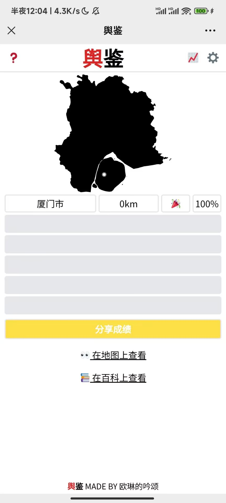
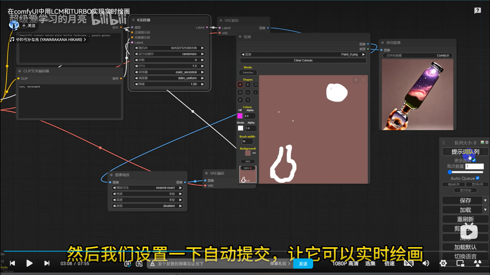

# 目前选题的可行性分析和预期实现效果报告
> 该文档撰写于2024.4.9
> 由饶东申展开的对目前选题的可行性分析和预期实现效果

## 选题1 图寻游戏
> 类似wordle/舆鉴 的小游戏 ( 地图相关?) 
> > by 许立恒

1. 可行性:
用户输入地名,返回结果(可以是与目标位置的**距离**,**方向**)~~猜数游戏~~
若猜对,还可以对目标地名进行科普,促进地区间文化交流(**主题相关**)
> (2) ⽂化传播辅助，通过互联⽹平台，⼈们可以及时接触到全球各地的⽂化内容，在线博物馆参观、虚拟⾳乐会，电⼦书和在线艺术画廊，极⼤地丰富了⼤家的⽂化⽣活;

2. 预期实现效果:
Web/手机app
*以下为[图寻](https://tuxun.fun/)的截图*

~~因为找不到这是哪所以没有结算截图,大家自行想象一下~~

*以下为小程序[舆鉴](https://heliumjt.gitee.io/chinale/)的截图*

~~盲狙的神~~
我们可以借鉴他的在百科上查看,但他是跳转到了百度百科

3. 可能遇到的重要问题:
如何存储**庞大的**图片和科普资料的数据

4. 难度预期: **

## 选题2 AI实时绘画辅助
> 就是我画几笔草图ai渲染给出图片
> >by 饶东申

1. 可行性:
绘画部分的代码有大量的**开源项目**(~~应该吧~~)可以借鉴,AI生成部分可以调用企业的**api接口**,网上也有不少关于搭建自己的实时绘画工作流的[攻略](https://www.bilibili.com/video/BV1K64y1W7b9/?p=4&vd_source=cf736fa5145b5933dd6d4aa8d5863f0b)~~还没具体实践~~
符合主题**文化创作辅助**
> (1) ⽂化创作辅助，利⽤AI⽣成艺术、 ⾳乐、甚⾄电影剧本，提供灵感和创意⽀持；

2. 预期实现效果:
Web/电脑app
[openArt](https://openart.ai/)

3. 可能遇到的重要问题:
绘画界面的代码(前端部分),如何调用AI和如何实现**实时**(后端部分)

4. 难度预期: ****

## 选题3 赛博数字人
> 以前貌似有见识过那种小程序根据你给的要求生成各种风格的人物之类的（估计也是ai） 就有点类似景区的纪念币一样的，可以自己选择风格和元素，最后生成特有的纪念画面之类的
> >by 陆亭羽
1. 可行性:
调用AI作画的**api接口**,类似的app较多,可供**学习和借鉴**
较符合主题:沉浸式文化体验
> (4) 数字媒体处理与沉浸式体验，运⽤VR、 AR等技术为⽤户提供沉浸式的⽂化体验。。。
> 
*最近看到的南方周末的推文[困守大山的脑瘫青年，活在克隆人虚拟世界](https://mp.weixin.qq.com/s/GKhsNSsfbFxBN3y1J8m70A)*

2. 预期实现效果:
手机app

3. 可能遇到的重要问题:
手机端的开发,ai模型的选择.

4. 难度预期 ***

## 其他暂时不考虑选题
1. ~~ai输入法~~: 不符合促进文化产业发展主题
2. ~~辅助生成科普视频~~: 不符合促进文化产业发展主题
3. ~~校园猫猫图鉴~~: 不符合促进文化产业发展主题
4. ~~猫猫视角的游戏~~: 预期难度较大

## 选题3.2 数字人加上一些智能互动~

