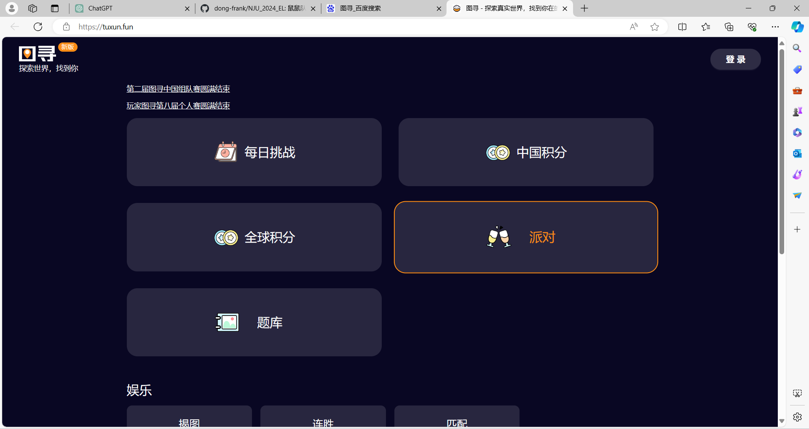
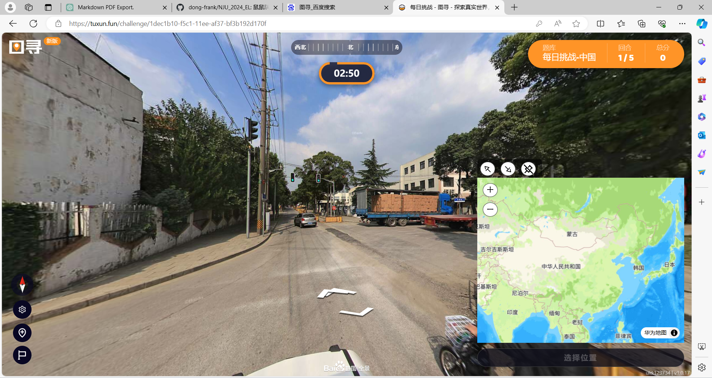

# 需求分析报告v1.0

## 项目名称
鼠鼠去哪儿(暂定)

## 项目描述
一个基于**手机端**开发的**图寻**小游戏,用户根据**地图剪影**和**街景图片**推理和猜测地点名称,并在逐步推理猜测的过程中向用户介绍**地区文化**,兼顾娱乐性和科普性的小游戏.
> 什么是图寻?
> > 一种地理知识类推理兴趣小游戏,其玩法是通过一张图片或一个街景,从而判断该地点所在国家(或省份或市)以及具体位置.

## 基本功能
1. 基本界面的交互
   1. 开始游戏
   2. 历史游玩记录
2. 图片的流畅呈现
   1. 地图剪影
   2. 街景图片
3. 地区文化知识的呈现
   1. 每次猜测错误后的提示
   2. 猜测正确后吸引用户的有意思的故事
4. 具有一定可玩性
   1. 题库具有较大规模(全球的热门地点+国内有意思小众地点+南大校园)
   2. 用户的成就感

*以下为[图寻](https://tuxun.fun/)的截图*

